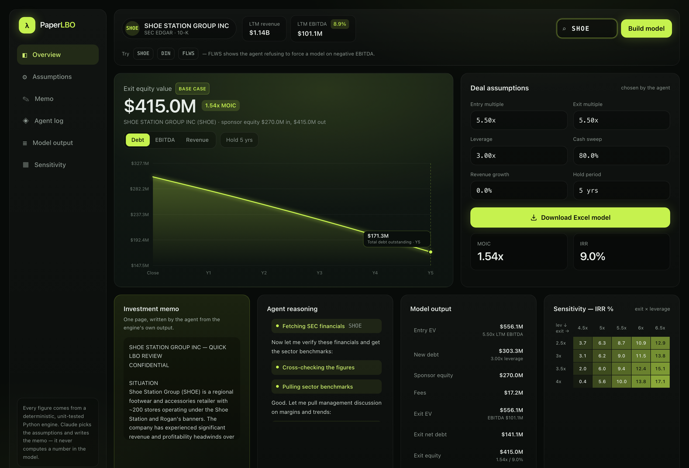

# PaperLBO

*A "paper LBO" is the back-of-the-envelope LBO that PE firms make candidates
grind through by hand as an interview screen. PaperLBO automates their own
test — end to end, from a ticker to a formatted model.*

An autonomous Claude agent that builds a leveraged-buyout model for a public
company from real SEC filings — sources & uses, a multi-tranche debt
schedule with a cash sweep, five-year projections, exit returns (MOIC/IRR),
and a sensitivity grid — and outputs a formatted Excel workbook plus a
one-page investment memo.

### ▶ [**Try it live — salcommisso123.github.io/paper-lbo**](https://salcommisso123.github.io/paper-lbo/)

No sign-up, no API key. Two real runs recorded against SEC filings and replayed in the
browser: **SHOE**, which builds a full model, and **FLWS**, where the agent refuses to
model negative EBITDA. The Excel workbook downloads from the page.

[](https://salcommisso123.github.io/paper-lbo/)

*A real run: ticker in, the agent's reasoning streaming live, and a finished model —
deleveraging curve, the assumptions it chose and defended, returns, an IRR sensitivity
grid, the memo, and the Excel workbook. The headline is always the flat-multiple **base
case** (exit multiple = entry); a run assuming multiple expansion is labelled as an
upside case and never shown as the top-line return. Captured from the recorded run in
`webapp/fixtures/SHOE.json` — a real run against real filings, replayed without an API call.*

Built as a portfolio project for private equity recruiting. It automates
what PE firms call a "paper LBO" — a standard interview screen — end to end:
give it a ticker, it fetches the filings, proposes and justifies its own
deal assumptions, runs the model, sanity-checks its own output, and hands
you back a workbook.

## A real run: SHOE (Shoe Station Group, formerly Shoe Carnival)

Built live from SEC EDGAR with the agent running on Claude Haiku 4.5
(≈$0.10 in API cost — see [Cost](#cost)). Workbook:
[`examples/real_output/SHOE_LBO_Model.xlsx`](examples/real_output/SHOE_LBO_Model.xlsx).

| | |
| --- | --- |
| LTM revenue / EBITDA (FY2025 10-K) | $1.14B / $101M (~8.9% margin) |
| Entry | 6.5x EV/EBITDA (~$657M EV) |
| Leverage | 3.5x EBITDA, 80% cash sweep |
| Exit | 6.5x (no multiple expansion), 5-year hold |
| **Base-case return** | **1.58x MOIC / 9.6% IRR** |

The interesting part is what the agent *didn't* do: it flagged the 9.6% IRR as
below a typical PE hurdle, explained why (declining revenue, thin retail
margins, a debt-free target that limits the leverage lever), and said so plainly
rather than dressing up a marginal deal. Point it at `--ticker FLWS` and it
refuses to build a model at all, because 1-800-Flowers' latest EBITDA is
negative — the "flag the bad data instead of forcing a polished-looking model"
behavior is the whole point.

## Why this exists

Trying to build a real LBO for a lower-middle-market target quickly runs
into a wall: firms like Mangrove Equity Partners or KLH Capital buy private
companies, and private companies don't file public financials. So this
project starts where the data actually exists — public companies via SEC
EDGAR, which is free and complete — to prove out the mechanics correctly and
verifiably. A `v2` extension that estimates financials for private targets
from indirect signals is sketched in `docs/ROADMAP_V2_PRIVATE_TARGETS.md`.

## Architecture (the part worth explaining in an interview)

```
ticker
  │
  ▼
edgar.py  ───────────►  SEC EDGAR (data.sec.gov, free, no key)
  │  pulls 10-K XBRL tags, computes LTM EBITDA, flags bad/missing data
  ├─ verify.py    ───►  cross-checks those figures & resolves the fiscal-year period
  ├─ benchmarks.py───►  NYU Stern / Damodaran sector multiples & margins (free, no key)
  ├─ filings.py   ───►  Item 7 MD&A via SEC full-text search — management's own words
  ▼
agent.py  ───────────►  Claude (tool-use loop)
  │  picks & justifies assumptions, calls lbo_engine as a tool,
  │  sanity-checks the result, can revise once, writes the memo
  ▼
lbo_engine.py            (pure Python — no LLM here)
  │  sources & uses, debt schedule w/ cash sweep, projections, IRR/MOIC
  ▼
excel_writer.py  ────►  formatted .xlsx workbook
```

The one decision that matters most: **Claude never computes a number that
ends up in the model.** It orchestrates (decides what to fetch, what
assumptions to try, whether the result looks sane) and it writes English
(the memo). Every dollar figure, every IRR, comes out of `lbo_engine.py`,
which is plain, tested Python. That's what makes the output auditable
instead of "an LLM said so" — see `tests/test_lbo_engine.py`, which checks
the engine against a hand-calculated example.

## Grounding: what stops the memo from drifting off the data

Three tools run before the memo is written, all free and key-less:

**`verify_financials`** cross-checks the figures the model is about to use, and
resolves *which period* a fiscal-year label actually covers. This exists because of a
real audit finding: a memo cited FY2021 revenue of $1.33B against a third-party
source showing ~$977M. Both were right — they are different periods.

> SEC labels a fiscal year by the year it **starts**. Shoe Carnival's `fy=2021` runs
> 2021-01-31 → 2022-01-29 ($1.33B). Most data providers label by the year it **ends**
> and call that same period FY2022; their "FY2021" is the prior COVID year (~$977M).

For any non-December year-end the two conventions are a full year apart. The tool now
surfaces the period end date, flags the ambiguity, and the system prompt requires the
memo to cite the end date alongside the label. It also compares revenue across
alternate XBRL tags, recomputes EBITDA by a second independent path, and checks
whether a figure was restated between filings — reporting both numbers and a flag for
anything more than ~5% apart, rather than silently picking one.

Its limitation is worth stating plainly: every check is SEC-sourced, so it cannot
detect an error in SEC's own data. A true second opinion needs a third-party vendor;
`verify._third_party_check` is the seam for one.

**`audit_memo` (in `memo_audit.py`)** runs deterministically *before* the workbook is
written and blocks it if the prose doesn't hold up. Two checks, because one isn't enough:

1. **Traceability** — does every `$` figure in the memo match a number some tool
   actually returned? Catches invented values.
2. **Label match** — is the figure next to the word "cash" actually the cash value?

The second exists because of a real failure. A memo said *"Net cash position of ~$9M
($101M cash - $0M debt)"* — $101M is EBITDA; cash was $117M. **A pure traceability check
passes that**, because $101M is a genuine tool value; it's just the wrong one. A figure
can be perfectly traceable and still lie about what it measures.

False positives are controlled by construction rather than by loosening: tolerance
follows the written precision (`$1.1B` accepts `$1,135,324,000`, `$9M` does not accept
`$117M`), each label is checked against its whole time series so "exit EBITDA" isn't
judged against LTM EBITDA, label context stops at line boundaries, and the nearest
label by edge distance wins so `$0M debt` binds to *debt*, not the *cash* earlier on the
same line. On a real 21-figure memo it reports clean; with the bug reintroduced it
catches both the mislabelled `$101M` and the invented `$9M`.

A failed audit blocks the write once and hands Claude the specific figures to fix. A
second attempt writes the file but carries the findings into the run summary, so a
problem is surfaced rather than silently buried.

**`get_industry_benchmarks`** replaces a hardcoded "6-9x" heuristic with real
sector EV/EBITDA and margin data from
[Damodaran's datasets](https://pages.stern.nyu.edu/~adamodar/New_Home_Page/data.html).
These are *public trading* multiples for minority stakes — a control LBO of a small,
declining target prices well below them — so the prompt uses them as a reference to
explain the entry multiple **against**, never a target to match.

**`get_management_discussion`** pulls Item 7 MD&A excerpts via SEC full-text search,
so the memo's narrative quotes what management actually said drove results instead of
a plausible-sounding inference.

All three are best-effort: if a source is down, the tool returns a status, the agent
notes the gap in the memo, and the run continues.

## Setup

```bash
cd paper-lbo
pip install -r requirements.txt
cp .env.example .env   # fill in ANTHROPIC_API_KEY and EDGAR_USER_AGENT
export $(cat .env | xargs)   # or just export the two vars directly
```

Run it:

```bash
python src/agent.py --ticker SHOE
```

This prints the agent's reasoning and tool calls live, and writes
`output/SHOE_LBO_Model.xlsx` (or whatever filename Claude chooses).

Run without an API key at all (no cost, no network beyond SEC):

```bash
python src/edgar.py SHOE          # just pull and print the raw financials
python examples/generate_demo.py  # regenerate the sample workbook with fixed assumptions
```

Run the tests (fully offline, no API key or network needed):

```bash
python -m pytest tests/ -v
```

## Web UI

A dark dashboard front end (`webapp/`): a ticker input, the agent's live
reasoning streaming in as it works, a deleveraging chart, the deal assumptions it
chose, the returns, an IRR sensitivity heatmap, the memo, and a downloadable Excel
model. It's a thin layer over the same tool-use loop the CLI runs
(`agent.iter_agent_events`) — no calculation logic is duplicated, and every number
on screen is passed straight through from `lbo_engine`. The screenshot at the top of
this README is an unedited capture of a real SHOE run.

```bash
pip install -r requirements.txt          # includes fastapi + uvicorn
uvicorn webapp.server:app --reload       # reads .env for the two keys
# open http://127.0.0.1:8000
```

### The live demo

**[salcommisso123.github.io/paper-lbo](https://salcommisso123.github.io/paper-lbo/)**

The public demo is a **static site** — the same page and the same renderer, replaying
recorded runs client-side. There is no backend, so no `ANTHROPIC_API_KEY` lives on any
server and a visitor can never spend API credits. It also has no cold start, which the
free container tiers do (~50s), and that matters when someone follows a link once.

`.github/workflows/pages.yml` builds it with `python tools/build_site.py` and publishes
to GitHub Pages on every push that touches the page, a fixture, or the builder.

```bash
python tools/build_site.py && python -m http.server -d site
```

The FastAPI server is unchanged and still runs live agent runs locally.

### Replaying a recorded run (no API key, no cost)

A run costs ~$0.10, and iterating on the UI usually needs several looks at a
finished one. Record a run once, then replay it for free:

```bash
python tools/record_run.py --ticker SHOE     # costs one run; writes webapp/fixtures/SHOE.json
```

```bash
open "http://127.0.0.1:8000/?replay=SHOE"    # free, forever after
```

A fixture is the exact event stream `agent.iter_agent_events` produced, so the replay
drives the real client code path — same SSE events, same renderer, real numbers. Add
`&delay=0` to render instantly instead of streaming.

Two fixtures are committed, so a fresh clone can see both outcomes with no API key:

| `?replay=` | What it shows |
| --- | --- |
| `SHOE` | A complete model — assumptions, returns, sensitivity, memo, workbook |
| `FLWS` | The agent **refusing** to model negative EBITDA, and saying why |

Enter a ticker, watch the agent fetch filings, propose and justify assumptions,
run the model, and write the workbook — then download it. Each run shows its own
token usage and estimated cost.

## What's in `examples/sample_output/`

A fully worked example workbook (`Example_Industrial_Services_LBO_Model.xlsx`)
built from representative sample financials — open this first if you just
want to see the output format before setting up an API key. It's clearly
labeled as illustrative, not a real filer.

## Cost

SEC EDGAR, the Damodaran datasets and SEC full-text search are all free. The
only real cost is Claude API usage. Measured on Claude Haiku 4.5, the default:

| Run | Cost |
| --- | --- |
| Full SHOE model | **~$0.06 – $0.09** |
| FLWS refusal (stops at bad data) | ~$0.007 |

The agent loop re-sends the whole conversation every turn, so by the last turn the
same system prompt, tool schemas and early tool results have been paid for ~9 times.
**Re-sending, not the payloads, is what a run costs** — the tool results themselves
total only ~2.4K tokens. [Prompt caching](https://docs.claude.com/en/docs/build-with-claude/prompt-caching)
is therefore the single biggest lever, and it's on by default.

Measured on one real run, with and without it:

| | Input billed | Total |
| --- | --- | --- |
| Without caching | 99,561 tokens | $0.148 |
| **With caching** | **34,931 equivalent** | **$0.083** |

65% off the input, 44% off the run. Every run prints its own cache hit rate.

The second lever is revisions. The prompt said "rerun ONCE" and a measured run called
the engine four times anyway, so the budget is now enforced in code rather than
requested: the base case plus one revision, plus at most one alternative-multiple
(upside) run, then `propose_and_run_lbo` refuses and tells the agent to explain the
tension instead of hunting for better numbers. Together:

| | Cost |
| --- | --- |
| Baseline — no caching, unbounded revisions | $0.148 |
| \+ prompt caching | $0.083 |
| **\+ revision budget** | **$0.061** |

**59% cheaper**, with no change to the model or the output's substance.

One catch worth knowing if you change models: the minimum cacheable prefix is
model-dependent and **not** monotonic across generations — Haiku 4.5 needs 4096
tokens, more than any other current model. The system prompt and tool schemas are
only ~3K, so marking *those* would silently cache nothing. The breakpoint goes in
the messages instead, which clears the minimum from about the third turn on.

With input largely handled, **output tokens are now ~58% of the bill**. The levers
left are the memo's length and how many times the agent revises.

Sonnet 5 is ~2x Haiku's rate — worth it for the version you actually send to a
recruiter, not for iterating.

The guardrails: a hard turn cap (`LBO_AGENT_MAX_TURNS`, default 12) so a confused
loop can't spiral, a per-response cap (`LBO_AGENT_MAX_TOKENS`), and every run
prints its own token usage and estimated cost so nothing is a surprise. Details
and per-model rates in [`docs/COST_CONTROL.md`](docs/COST_CONTROL.md). Set a spend
limit in the Anthropic Console before you start using this for real.

## Project layout

```
src/
  edgar.py         SEC EDGAR fetch + parse (no LBO logic)
  verify.py         independent cross-checks + fiscal-period resolution
  benchmarks.py     NYU Stern / Damodaran sector benchmarks
  filings.py        10-K MD&A retrieval via SEC full-text search
  memo_audit.py     blocks the write if a memo figure is invented or mislabelled
  lbo_engine.py     deterministic LBO math (no LLM, no data-fetching)
  excel_writer.py   formats an LBOResult into a .xlsx workbook
  agent.py          the Claude tool-use loop that ties the above together
tests/
  test_lbo_engine.py    engine checked against hand-calculated numbers
  test_edgar_parser.py  SEC JSON parsing checked against a saved fixture
  test_verification.py  fiscal-year labelling, industry matching, MD&A parsing,
                        memo figure audit (incl. the exact audited bug)
examples/
  generate_demo.py      builds the sample workbook with no API key needed
docs/
  ARCHITECTURE.md            design rationale, deeper than this README
  COST_CONTROL.md            how the "no surprise fees" goal is enforced
  ROADMAP_V2_PRIVATE_TARGETS.md   the private-target estimation stretch goal
```
